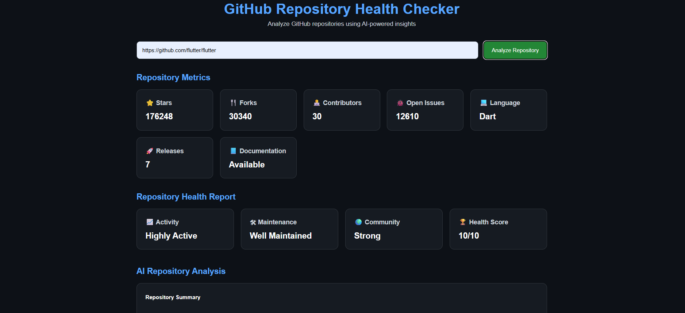
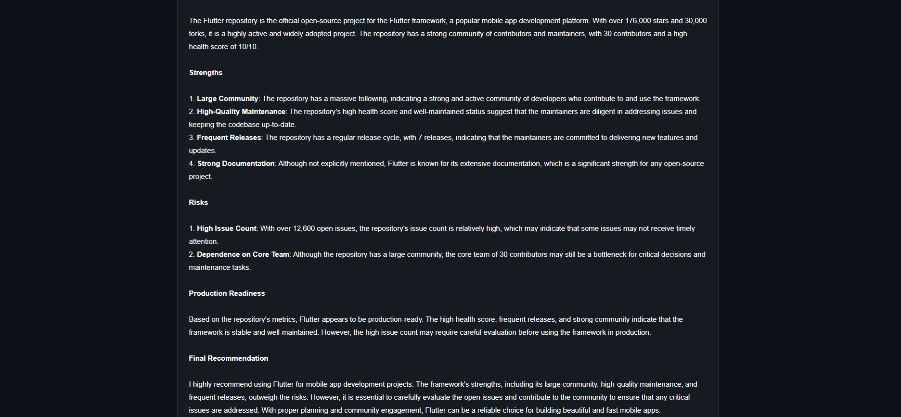

# 🚀 GitHub Repository Health Checker

An AI-powered GitHub Repository Health Checker that analyzes public GitHub repositories using GitHub APIs and NVIDIA LLM APIs.

The application evaluates repository activity, maintenance quality, community strength, documentation availability, and production readiness using custom health scoring logic and AI-generated insights.

---

# ✨ Features

- 🔍 Analyze any public GitHub repository
- 📊 Repository metrics visualization
- 🤖 AI-powered repository analysis
- 🏆 Custom repository health scoring system
- 📘 README/documentation detection
- 📈 Activity and maintenance evaluation
- 🌍 Community strength analysis
- ⚡ Responsive modern UI
- 🔗 GitHub API integration
- 🧠 NVIDIA LLM integration

---

# 🖼️ Project Preview

## Analysis Dashboard - Part 1



---

## Analysis Dashboard - Part 2



---

# 🛠️ Tech Stack

## Frontend
- HTML
- CSS
- Vanilla JavaScript

## Backend
- Python
- Flask

## APIs & AI
- GitHub REST API
- NVIDIA LLM API

## Deployment
- Render (Backend)
- Vercel (Frontend)

---

# 📂 Project Structure

```bash
github-repository-health-checker/
│
├── frontend/
│   ├── index.html
│   ├── style.css
│   └── script.js
│
├── backend/
│   ├── app.py
│   ├── config.py
│   ├── requirements.txt
│   ├── runtime.txt
│   ├── .env
│   │
│   ├── routes/
│   │   └── analyze_routes.py
│   │
│   ├── services/
│   │   ├── github_service.py
│   │   ├── health_service.py
│   │   └── ai_service.py
│   │
│   └── utils/
│       └── validators.py
│
├── screenshots/
│   ├── analysis-1.png
│   └── analysis-2.png
│
├── README.md
├── LICENSE
└── .gitignore
```

---

# ⚙️ Backend Setup

## 1. Navigate to backend folder

```bash
cd backend
```

---

## 2. Create virtual environment

### Windows

```bash
python -m venv venv
```

---

## 3. Activate virtual environment

```bash
venv\Scripts\activate
```

---

## 4. Install dependencies

```bash
pip install -r requirements.txt
```

---

## 5. Configure environment variables

Create a `.env` file inside the backend folder.

```env
GITHUB_TOKEN=your_github_token

NVIDIA_API_KEY=your_nvidia_api_key
```

---

## 6. Run backend server

```bash
python app.py
```

Backend runs on:

```bash
http://127.0.0.1:5000
```

---

# 💻 Frontend Setup

## 1. Navigate to frontend folder

```bash
cd frontend
```

---

## 2. Open using Live Server

Recommended:
- VS Code Live Server Extension

---

# 🔑 API Keys Setup

## GitHub Token

Generate token from:

https://github.com/settings/tokens

---

## NVIDIA API Key

Generate API key from:

https://build.nvidia.com/

---

# 📡 API Endpoint

## Analyze Repository

### POST

```bash
/analyze
```

---

### Request Body

```json
{
  "repo_url": "https://github.com/flutter/flutter"
}
```

---

### Response Example

```json
{
  "success": true,
  "repository": {},
  "health_report": {},
  "ai_analysis": {}
}
```

---

# 🧠 Repository Health Metrics

The project evaluates repositories using:

- Repository activity
- Last commit date
- Stars and forks
- Contributors count
- Releases availability
- Documentation presence
- Community strength
- Maintenance quality

---

# 🚀 Deployment

## Backend Deployment
- Render

## Frontend Deployment
- Vercel

---

# 🎥 Demo Videos

## Quick Working Demo

[Watch Working Demo](https://drive.google.com/file/d/12xWioregYTDjSYekjk2jPThClLCIQb6d/view?usp=sharing)

---

## Project Presentation

[Watch Presentation Video](https://drive.google.com/file/d/1ql6v8ysWCM5AoTn66HOftwLq2qA2g5Cd/view?usp=sharing)

---

# 🔮 Future Improvements

- Repository charts and analytics
- Commit frequency graphs
- Repository comparison
- Authentication system
- Saved repository history
- Exportable PDF reports
- Dark/light theme switch

---

# 👨‍💻 Author

Lakshya Tripathi

- GitHub: LakshyaGitHub98
- Email: laktripathi9839@gmail.com

---

# 📄 License

This project is licensed under the MIT License.
